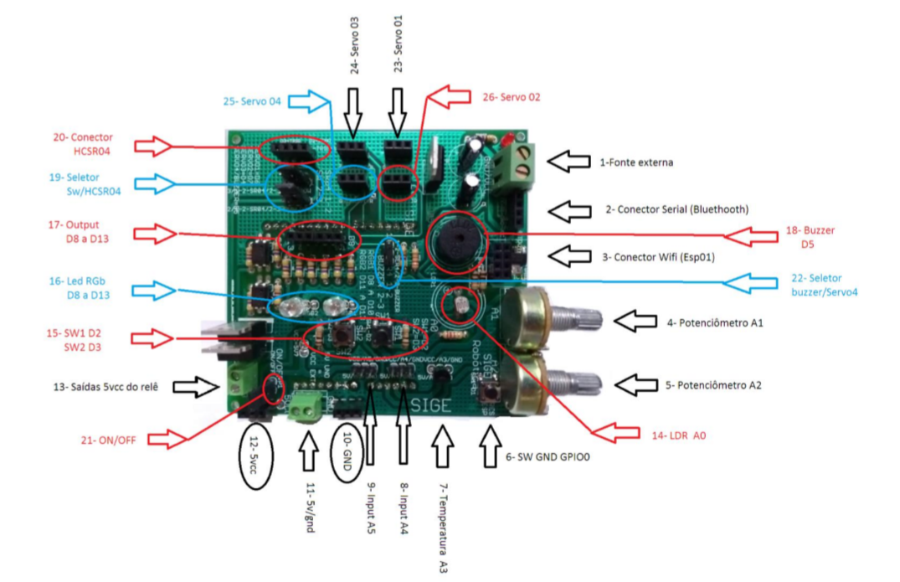

# Shield Sige Educacional Robótica

## Instruções de instalação

1. Encaixe o Arduino UNO em baixo da placa Sige Robótica, nos conectores apropriados.

> **Não se preocupe!** Só tem uma forma de encaixar o Arduino na placa Sige Robótica, pela disposição dos pinos ser única, não permitindo encaixar de outra forma.

2. Ligue a Fonte de Alimentação 7V ~ 12V nos terminais do conector 13, lembrando de seguir a polaridade VCC = positivo e GND = negativo.

> **Cuidado!** Não inverta a polaridade da fonte externa! Em caso de dúvidas, sempre consulte o *Diagrama de Conexões* e também a *Tabela de Conexões*, mais abaixo.

3. Efetue o Download e a instalação do Arduino IDE, que pode ser baixada no link abaixo:

> https://www.arduino.cc/en/Main/Software

4. Pronto! Só começar a usar! 

## Modo de uso

Acompanhe as aulas do Curso Arduino no link abaixo e aprenda mais sobre essa plataforma fantástica de aprendizado em robótica!

> https://www.youtube.com/cursoarduino 

## Diagrama de conexões

## Descrição das funcionalidades

1. **Fonte externa** A Sige Robótica é composta por um circuito redutor de tensão capaz de receber alimentações de fontes externas entre 7 a 12vcc. 
 
2. **Conector Serial Bluethooth** Este conector permite com facilidade, interligar o módulo Bluethooth HC06. Padrão do conector é Vcc, gnd, RX, TX . Divisor de tensão já nativo na placa. 
 
3. **Conector Wifi (esp01)** Este conector permite a comunicação com o esp 01, possibilitando projetos com a rede wifi. A comunicação entre o Arduino e o esp é por serial, regulador 3,3v e divisor tensão nativos na placa. 
 
4. **Potenciômetro A1** Potenciômetro de 10k nativo da placa e ligado na porta analógica A1.
 
5. **Potenciômetro A2** Potenciômetro de 10k nativo da placa e ligado na porta analógica A2. 
 
6. **SW GND GPIO0** Chave usada para fechar o gnd ao GPIO0 do esp, normalmente usada para reiniciar as configurações WIFI.
 
7. **Temperatura A3** Composto pelo sensor de temperatura LM35,  ligado na porta analógica A3.  
 
8. **Input A4** Porta analógica A4 disponível no padrão do conector VCC/A4/GND.
 
9. **Input A5** Porta analógica A5 disponível no padrão do conector VCC/A5/GND. 
 
10. **Barras de Pinos GND.**
 
11. **Conector 5VCC/GND**
 
12. **Barra de Pinos 5VCC**
 
13. **Saída 5vcc do rele**  São dois conectores ligados a reles  estado solido, que permite ligar pequenos circuitos com limite de corrente em 400ma, acionados através das digitais D12 e D13.  
 
14. **LDR A0** Circuito nativo da placa usado para detectar luminosidade,  ligado na analógica A0.   
 
15. **SW1 D2 / SW2 D3** Botões interligado as portas digitais D2 e D3, circuito PullDow nativo mantendo em nível lógico low quando não pressionados e ao pressionar inverte o sinal lógico para High, (5vcc). O PullDow é habilitado no seletor Sw/HCSR04, onde precisamos colocar na posição 2-3. 
 
16. **Led RGB D8 a D13** São dois Grupos de leds RGB, o primeiro grupo esta ligado na digital D8(vermelho), digital D9(verde) e digital D10(Azul). O segundo grupo temos digital D11(vemelho), digital D12(verde) e digital D13(azul)   

> **Obs.:** lembrando que sempre que acionar o D12 e o D13 as saídas dos reles estado sólido também serão ligadas.
 
17. **Output D8 a D13** São barras de pinos interligadas as digitais D8 a D13, usada para outras funções além dos RGBs  e Reles . 
 
18. **Buzzer D5** O circuito do Buzzer é a sirene para as práticas educacionais, ele esta ligado na porta D5 e precisa de estar configurado no seletor Buzzer/ Servo4 na posição 2-3. 
 
 
19. **Seletor SW/ HC-SR04** este dois blocos de seletores definem o modo de operação das digitais D2 e D3, podendo ser PullDow para os botões na posição 2-3 e Trig e Echo para o HC-SR04 sensor ultrasônico na posição 1-2. 
 
20. **Conector HC-SR04**  Fácil conexão do sensor ultrasônico HC_ SR04 no padrão VCC-TRIG-ECHO-GND. (D3 TRIG E D2 ECHO). 

21. **Seletor  ON/OFF** Chave seletora de Ligado ou desligado.  
 
22. **Seletor Buzzer/Servo 4** Este seletor define a função da digital D5, podendo ser função buzzer na posição 2-3 e usar a digital D5 para o Servo 4 na posição 1-2. 
 
23. **Servo 01** Conector no padrão Servo motor, GND/VCC/CTR. O servo 01 é controlado pela digital D6. 
 
24. **Servo 03** Conector no padrão Servo motor, GND/VCC/CTR. O servo 03 é controlado pela digital D4. 
 
25. **Servo 04** Conector no padrão Servo motor, GND/VCC/CTR. O servo 04 é controlado pela digital D5. 
 
26. **Servo 02** Conector no padrão Servo motor, GND/VCC/CTR. O servo 02 é controlado pela digital D7. 

## Tabela de conexões

Sige robótica educacional, mapeamento das portas

| Porta | Função      | Seletor 1-2 | Seletor 2-3  |
| ----- | ----------- | ----------- | ------------ |
| D0    | RX          |             |              |
| D1    | TX          |             |              |
| D2    |             | ECHO SR04   | SW1 PULLDOWN |
| D3    |             | TRIG SR04   | SW2 PULLDOWN |
| D4    | SERVO 03    |             |              |
| D5    |             | SERVO 04    | BUZZER       |
| D6    | SERVO 01    |             |              |
| D7    | SERVO 02    |             |              |
| D8    | LED1 VERM   |             |              |
| D9    | LED1 VERDE  |             |              |
| D10   | LED1 AZUL   |             |              |
| D11   | LED2 VERM   |             |              |
| D12   | LED2 VERDE  | RELE 1      |              |
| D13   | LED2 AZUL   | RELE 2      |              |
| A0    | LDR         |             |              |
| A1    | POT 1       |             |              |
| A2    | POT 2       |             |              |
| A3    | LM35 TEMP.  |             |              |
| A4    | LIVRE       |             |              |
| A5    | LIVRE       |             |              |